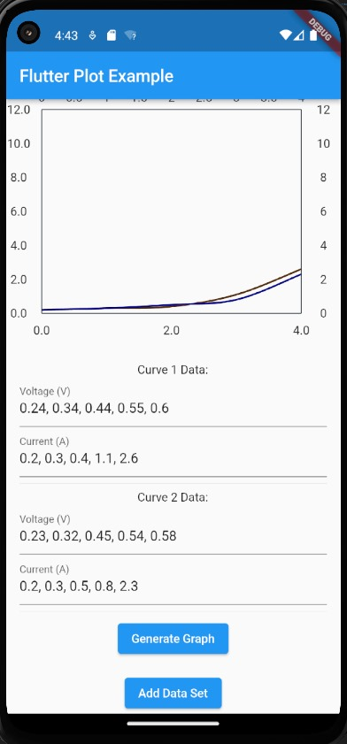

# Graph Generator App 

A new Flutter project.

## Getting Started

This project is a starting point for a Flutter application.

A few resources to get you started if this is your first Flutter project:

- [Lab: Write your first Flutter app](https://docs.flutter.dev/get-started/codelab)
- [Cookbook: Useful Flutter samples](https://docs.flutter.dev/cookbook)

For help getting started with Flutter development, view the
[online documentation](https://docs.flutter.dev/), which offers tutorials,
samples, guidance on mobile development, and a full API reference.

# What is  this project:-

An  Flutter App Where we Can Create a X & Y Axis graph with decimal Points.We can add as many as Curve or Line we want in a single graph.So  while plotting graphs for  our Lab Experiments We Often faced Problem in getting the exact nature of the graphs, so to get the exact nature the graph, like whether decreasing or increasing,I have created an Flutter App,which will be helpful for getting the nature & plot of the Graph, as sometimes points on both x-axis & y-axis are on decimals & data set gets huge which sometimes become frustrating to plot graphs & this might be a problem as in certain Experiments graphs are of utmost importance to get the conclusion of the whole Experiment

## User Stories

-   [ ] User can see Create X & Y Axis Graph Via User Input
-   [ ] User can click a button"Generate Graph" to create the Graph. When this button is clicked, the Graph will be plotted
  - [ ] User can click a button"Add data set" to craete more than 1 date set  to be  plotted in a single graph

## Bonus features

-   [ ] More Than 1 Line or Curve can Be Created in a Single Graph
-   [ ] Decimal Data Types are Allowed
-   [ ] We Can insert our Points like this"0.24, 0.34, 0.44, 0.55, 0.60, 0.61, 0.62, 0.62, 0.62, 0.62, 0.62, 0.62, 0.62, 0.62, 0.63, 0.63, 0.63, 0.63, 0.63, 0.63, 0.63, 0.63, 0.63, 0.64, 0.64, 0.64, 0.64, 0.64", Seperated by",". to ease the user input Experince

## Useful links and resources( for this specific project)

-   [Flutter Documentation](<https://pub.dev/packages/fl_chart>)

# Working Example:-

