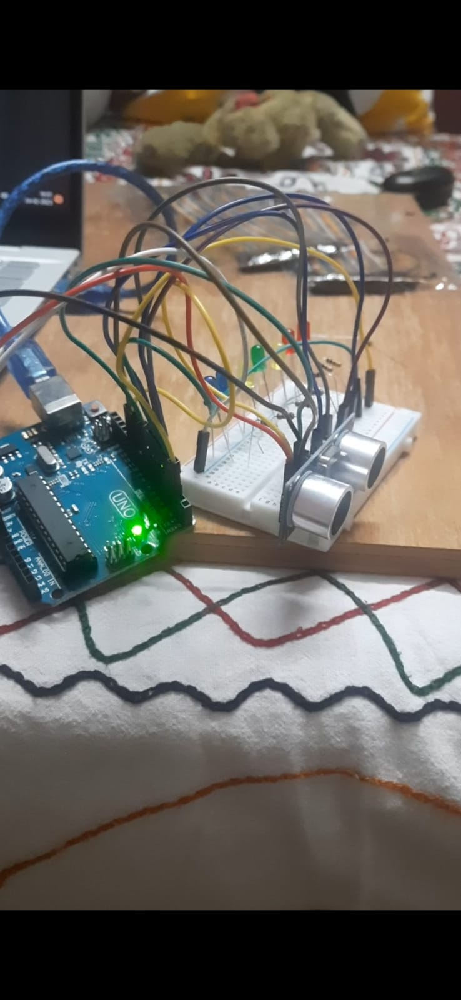

# Led-Distance-Indicator

# Parts Required For Building The Circuit:-

<ul>
  <li>Jumper Wires</li>
  <li>Breadboard</li>
  <li>Plane Surface(Plywood or Fibre)</li>
  <li> 7 LED</li>
  <li> 7 1ohm Resistor</li>
  <li>Arduino UNO R3(Main Computing Part of the Circuit)</li>
  <li> Ultrasonic Sensor HSRC90</li>
  <li>Charger(coaxial power connectors) Or Battery (9-12V) </li>
</ul>

# Code 

 Pin.no must be followed properly while constructing the circuit 
 
# Output 

 It Measures Distance & Indicate it in Led accordingly 
<ul>
   <li>5cm=Red</li>
  <li>7cm=Red</li>
  <li>10cm=Yellow</li>
  <li>15cm=Green</li>
  <li>17cm=Yellow</li>
  <li>20cm=Blue</li>
  <li>25cm=Blue</li>
</ul>
By Going through the code we can easily change the led color &  It's respective distance