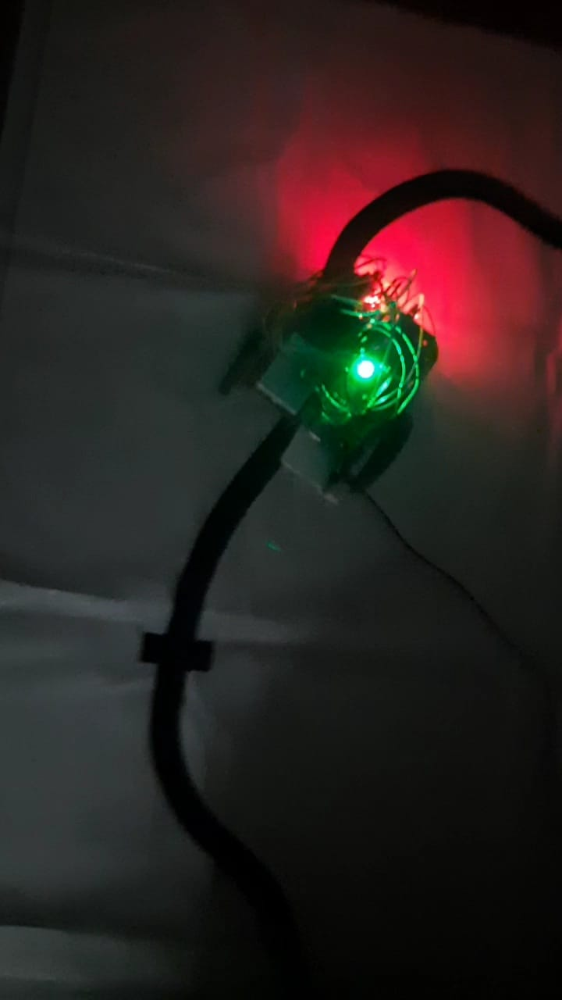

# Line Follower Bots

 

# Parts Required For Building The Bot:-

<ul>
  <li>Jumper Wires</li>
  <li>Breadboard</li>
  <li>Chasis(Plywood or Fibre)</li>
  <li> 2 Bo Motor</li>
  <li> 2 IR Sensor(Used for detecting White or Black Background & Line)</li>
  <li>Arduino UNO R3(Main Computing Part of the Bot)</li>
  <li>2 Wheel</li>
  <li>ln238 Motor Drive(Used for Commanding Motor )</li>
  <li>Charger(coaxial power connectors) Or Battery (9-12V) </li>
</ul>

# Black_Line_Follower

Here You will find my Code for Black Line with White Background

# White_Line_Follower

Here You will find my code For White Line With Black Background

 
