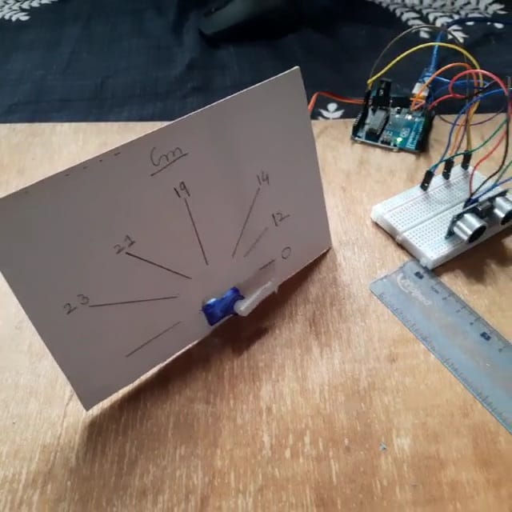

# Servo-Distance_Indicator

# Parts Required For Building The Circuit:-

<ul>
  <li>Jumper Wires</li>
  <li>Breadboard</li>
  <li>Plane Surface(Plywood or Fibre)</li>
  <li> 1 Paper CardBoard (To Write The distance to be measured)</li>
  <li>Arduino UNO R3(Main Computing Part of the Circuit)</li>
  <li>Servo Motor(9G)</li>
 <li> Ultrasonic Sensor HSRC90</li>
  <li>Charger(coaxial power connectors) Or Battery (9-12V) </li>
</ul>

# Code 

 Pin.no must be followed properly while constructing the circuit 
 
# Output 

 It Measures Distance & Indicate it in Servo motor based Odometer(device used for measuring distance) in Centimeter(Cm) 
