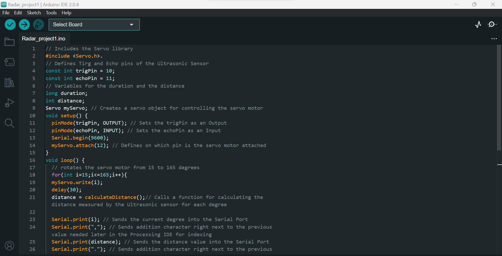
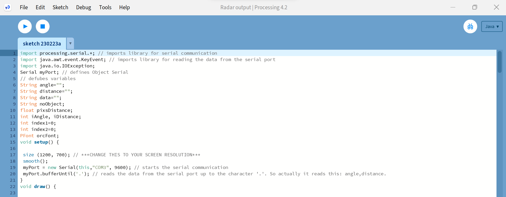

# Ultrasonic_Radar

 

# Parts Required For Building The Radar:-

<ul>
  <li>Jumper Wires</li>
  <li>Breadboard</li>
  <li>Plane Surface For The Whole Setup(Plywood or Fibre)</li>
  <li>Servo Motor(9G)</li>
  <li> Ultrasonic Sensor HSRC90</li>
  <li>Arduino UNO R3(Main Computing Part of the Radar)</li>
  <li>Charger(coaxial power connectors) Or Battery (9-12V) </li>
</ul>

# Radar_Code 

  Here is the radar code written in Arduino file(ino file).

# Radar_Output
Here you can Find the code for showing in output or radar Screen it is written in an processing ide called "processing 4".You need to download it 

  It uses 3 java libary mainly:-
<ul>
  <li>processing.serial(imports libary for serial communication)</li>
<li>java.awt.event.KeyEvent(imports library for reading the data from the serial port)</li>
<li>java.io.IOException</li>
  </ul>

# Here is the output Screen Showing Detection of the Object 

 
